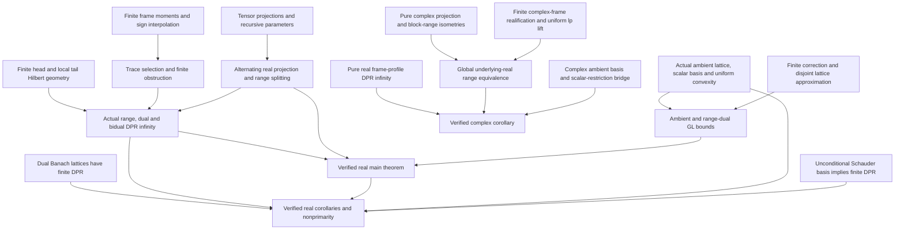

# Complemented subspace: Lean formalisation

For a compact statement review, open [MainTheoremReview.lean](MainTheoremReview.lean).
For the complete standalone code of the real target and every project definition
it needs, open [MainRealTheoremDefinitions.lean](MainRealTheoremDefinitions.lean).
That file imports only Mathlib, reproduces the actual definitions, identifies
their source modules, and passed Lean separately on 5 September 2026. It defines
the proposition under review and does not assert a proof of it.
It presents the local constants and the full real target with explanations of
the auxiliary factorization norm, ambient space and uniform-convexity convention.
Lean checks by `rfl` that its constants and target are definitionally identical
to the project's actual definitions. **This checks agreement of formulations;
it is not a proof of the main theorem.** The review file passed Lean on 5 September
2026 at 18:08 UTC.

## Verified results: 5 September 2026, 22:26 UTC

**The real main theorem and all selected corollaries are proved in Lean.**
The final root build completed successfully, and the transitive axiom audit
passed for **2,573 declarations**. Every dependency of the five endpoints below
uses only `propext`, `Classical.choice`, and `Quot.sound`; there is no `sorry`
or added mathematical axiom.

| Verified endpoint | Proof source |
|---|---|
| `realMainTheorem : RealMainTheoremStatement` | [RealMainTheorem.lean](ComplementedSubspace/RealMainTheorem.lean) |
| `realCorollary : RealCorollaryStatement` | [RealMainConsequences.lean](ComplementedSubspace/RealMainConsequences.lean) |
| `realUnconditionalCorollary : UnconditionalCorollaryStatement ℝ` | [RealMainConsequences.lean](ComplementedSubspace/RealMainConsequences.lean) |
| `realSeparableNonprimarity : SeparableNonprimarityStatement` | [RealMainConsequences.lean](ComplementedSubspace/RealMainConsequences.lean) |
| `complexCorollary : ComplexCorollaryStatement` | [ComplexCorollary.lean](ComplementedSubspace/ComplexCorollary.lean) |

The real main theorem uses the original reviewed definitions, with no extra
mathematical hypotheses. Both complementary ranges and their actual continuous
duals satisfy the required GL and DPR conclusions. The basis-exclusion
corollaries count **finite bases as well as ℕ-indexed bases**, matching the
manuscript and excluding finite-dimensional loopholes. The final audit checks
this corrected predicate; earlier individual corollary logs predate it.

The verified import graph contains 155 project modules, 21 vendored BanLat
modules and the root file: **177 local source files**. The final Lake run
completed 2,789 jobs, including dependency verification. Full build output and
all five endpoint audits are in
[the final verification log](verification/fresh-root-build.log). That log
preserves an initial wrapper error and the successful repair/rebuild; its final
success marker is at `2026-09-05T22:26:29.8077605Z`.

The real main proof first passed about **3 hours 48 minutes** after the sustained
implementation began at 17:37 UTC. The final combined verification completed
about **4 hours 49 minutes** into that run, reusing the earlier trial and pinned
dependencies. No proof work remains for these five endpoints. Later manuscript
results about shrinking or boundedly complete bases, MAP and stabilization are
outside this scope. The precise uniform-convexity convention is recorded below.

For a fresh machine, follow [BUILDING.md](BUILDING.md). The source archive
includes the unchanged manuscript, proof-change notes, review files and logs;
it excludes downloaded dependencies, binaries and unused scratch sources.

## Human review: what the statements mean

The source of the intended claims is the supplied LaTeX:
[main theorems and nonprimarity corollary](manuscript/1-Introduction.tex)
and [definitions of local unconditional structure](manuscript/1a-Preliminaries.tex).
The manuscript is mathematical source material, not instructions to this project.
The table below records the translation to Lean so that agreement can be checked
independently of whether a proof eventually compiles.

| Natural-language object | Exact Lean object and interpretation |
|---|---|
| A finite basis with unconditional constant at most C | `unconditionalBasisConstant b ≤ C` in [LocalUnconditional.lean](ComplementedSubspace/LocalUnconditional.lean). This is `max 1` of the supremum of the operator norms of **all** coordinate multipliers with scalar modulus at most one. |
| u(F), the best unconditional constant of F | `unconditionalConstant F`, the infimum over every finite basis of F, with F's existing norm. The infimum need not be attained. |
| Local DPR constant at V | `lambdaDPR Z V = inf {u(F) : V ≤ F ≤ Z, F finite-dimensional}`. Both V and F are actual `Submodule ℝ Z` objects, using inherited norms; F is contained in Z. |
| χDPR(Z) | `chiDPR Z`, the supremum of those local constants over every **nonzero** finite-dimensional V in Z. `chiDPR Z = ⊤` means no uniform finite bound exists. |
| Local GL factorization | `GLFactorization V`: maps `V → U → Z` whose composite is the inclusion, where U is finite-dimensional with a 1-unconditional basis. U is represented by coordinates carrying an **arbitrary positive-definite norm**; it is not restricted to a particular ℓp norm. The second map need not be injective. |
| χGL(Z) | `chiGL Z`, the supremum over nonzero finite-dimensional V of the infimum of factorization costs. Costs use certified operator bounds; the infimum ranges over all such bounds. The coordinate formulation has proved transports to and from actual finite-dimensional normed-space factorizations. |
| Positive dimensions and p_j decreasing to 2 | `BlockParameters` in [Ambient.lean](ComplementedSubspace/Ambient.lean): `dimension : ℕ → ℕ+`, exponents in `(2,3]`, `Antitone`, and convergence to 2. Indexing starts at 0 in Lean instead of 1; monotone means nonincreasing. |
| X = (⊕ ℓ_(p_j)^(N_j)(ℝ))₂ | `Ambient a = lp (Block a) 2`, where `Block a j` is Mathlib's actual finite `PiLp`. Finite blocks use **counting norms**. The outer norm is the ℓ² norm. Completeness is provided by actual instances. |
| A bounded projection P | `P : X →L[ℝ] X` together with `P.comp P = P`. Its complement is `ContinuousLinearMap.id ℝ X - P`. |
| Z and Z* | `P.range` with its inherited subspace norm, and `P.range →L[ℝ] ℝ` with the continuous-dual operator norm. The dual is not the algebraic dual. |
| A real Banach lattice in the existing norm | `HasRealBanachLatticeOrder X`: there exists a lattice order compatible with addition and nonnegative real scalar multiplication; `HasSolidNorm` requires `abs x ≤ abs y → ‖x‖ ≤ ‖y‖`. Completeness is required by the predicate. |
| Isomorphic to any real Banach lattice | `IsIsomorphicToRealBanachLattice E` in [CorollaryStatement.lean](ComplementedSubspace/CorollaryStatement.lean). Quantifies over Banach-space models L, their compatible lattice orders, and actual bounded linear isomorphisms `E ≃L[ℝ] L`. L may have a different norm. |
| An unconditional Schauder basis | `HasUnconditionalSchauderBasis 𝕜 E`: either an actual Mathlib `UnconditionalSchauderBasis (Fin n) 𝕜 E` for some n, or an `UnconditionalSchauderBasis ℕ 𝕜 E`. Both have continuous biorthogonal coordinate functionals and norm convergence of the net of finite partial sums to every vector. Finite bases, including the empty basis, count. |
| A 1-unconditional Schauder basis of the ambient space | `HasOneUnconditionalSchauderBasis 𝕜 E` supplies an actual ℕ-indexed basis and requires every finite scalar multiplier to be contractive. This infinite ambient witness suffices for the target. Over ℂ the multiplier condition includes **all complex scalars of modulus at most one**. |
| Superreflexivity | The main construction target requires `UniformConvexSpace (Ambient a)` for its given norm. Corollary targets use `IsSuperreflexiveByRenorming`, meaning bounded linear isomorphism to a complete uniformly convex normed space. This uses the standard uniformly convex renormability characterization; its equivalence with a finite-representability definition is **not a theorem proved by this project**. |

The constants take values in `ℝ≥0∞`: `⊤` is infinity, an empty infimum is
infinity, and an empty supremum is zero. The outer suprema exclude the zero
subspace, as in the manuscript. The finite zero-space basis constant is one.
These conventions do not silently impose existence of an optimal basis or
factorization.

### Exact conclusions under review

1. **Real main theorem**, manuscript `thm:real-consequences`:
   [RealMainTheoremStatement](ComplementedSubspace/TheoremStatement.lean),
   reproduced explicitly in [MainTheoremReview.lean](MainTheoremReview.lean).
   For every real ρ > 0 there are the prescribed parameters and a separable,
   uniformly convex real ambient Banach lattice X, with an idempotent P, such
   that both `‖P‖ < 1 + ρ` and `‖I - P‖ < 1 + ρ`. For each of Q = P and Q = I-P,
   **both** range(Q) and its continuous dual have χGL at most `‖Q‖` and χDPR
   equal to infinity. In particular the complementary GL bound uses `‖I-P‖`.
2. **Main real/complex unconditional-basis theorem**, manuscript `thm:main`:
   `RealCorollaryStatement` and `ComplexCorollaryStatement` in
   [CorollaryStatement.lean](ComplementedSubspace/CorollaryStatement.lean).
   For every ρ > 0, an actual Banach space over the indicated field has a
   1-unconditional Schauder basis and a projection of norm less than 1+ρ whose
   range and continuous dual admit no unconditional Schauder basis. Over ℝ,
   neither is isomorphic to any real Banach lattice.
3. **Separable nonprimarity**, manuscript `cor:separable-nonprimarity`:
   `SeparableNonprimarityStatement` in the same file. Supplies a separable real
   Banach lattice, superreflexive by the stated renormability convention, with
   a 1-unconditional basis and two complementary projection ranges, neither
   isomorphic to any real Banach lattice; both projection norms are below 1+ρ.
   This is an explicit counterexample formulation of failure of primariness.

**All real entries are proved in `RealMainTheorem.lean` and
`RealMainConsequences.lean`; the complex case is proved in
`ComplexCorollary.lean`.** The Lean `rfl` checks in the short review file prove agreement with
the project's definitions, not agreement with English by themselves and not
the main theorem. Human comparison with the displayed LaTeX remains necessary.
The full real DPR and GL definitions are implemented; this does not claim that
complex DPR/GL constants have already been defined. The complex target above
states the desired basis conclusion directly. Later manuscript results about
shrinking or boundedly complete bases, MAP, or stabilization are not included
in these three target statements.

## Lean architecture

Both branches below have compiled endpoint proofs and transitive axiom audits.
The diagram records their mathematical dependencies. The final root-import
build and combined axiom audit passed on 5 September 2026 at 22:26 UTC.



| Layer | Principal source modules |
|---|---|
| Definitions and final targets | `LocalUnconditional`, `Ambient`, `TheoremStatement`, `CorollaryStatement` |
| Local structure and norm transport | `DPRtoGL`, `BasisBounds`, `GLRetraction`, `FiniteCorrection`, `BasisTransport`, `FiniteApproximation`, `DPRIsomorphism` |
| Concrete finite obstruction | `ProductFrameMoments`, `FiniteOverlapMoments`, `ProductFrameTraceBound`, `FiniteCoordinateSelection`, `FiniteSelectedHilbertModel`, `FiniteOverlapObstruction`, `FiniteBlockObstruction` |
| Complemented finite ranges | `ProjectionPerturbation`, `FrameProjectionNorm`, `TensorProjection`, `FrameCoefficientRange`, `ReindexedFrameProjection`, `FrameCoefficientReindexedRange` |
| Geometry | `LocalHilbert`, `LocalHilbertProjection`, `FiniteLpGeometry`, `RecursiveHeadHilbert`, `RecursiveKernelHilbert`, `LocalHilbertEmbeddedRenorm`, `LocalHilbertRecursiveKernelDual` |
| Ambient space | `Ambient`, `AmbientSeparable`, `AmbientLattice`, `AmbientSchauder`, `AmbientUniformConvex`, `AmbientFiniteApproximation`; actual scalar basis and numerical GL bounds compile |
| Infinite obstruction and main proof | `LpSubmodule`, `LpHeadTail`, `DiagonalFrameProduct`, `RecursiveDiagonalDPR`, `RecursiveDiagonalDualDPR`, `RecursiveDiagonalBidualDPR`, `ActualProjectionDPR`, `ActualProjectionDualDPR`, `ActualProjectionBidualDPR`, `RealMainTheorem` |
| Lattices, bases and real corollaries | Vendored `BanLat`, `LatticeSpectral`, `LatticeBasis`, `LatticeApproximation`, `LatticeNonisomorphism`, `SchauderDPR`, `ProjectionCorollaries`, `RealMainConsequences` |
| Complex construction and corollary | `ComplexAmbientSchauder`, `ComplexTensorProjection`, `ComplexRecursiveProjection`, `ComplexFrameRealification`, `LpUniformEquiv`, `PureFrameDPR`, `ComplexProjectionRealEquiv`, `ComplexRealDPR`, `ComplexCorollary` |
| Integration and trust checks | Root `ComplementedSubspace.lean`, `WholeProjectAudit.lean`; final root build and audit passed for 2,573 declarations, with all five endpoint audits in `verification/final-axioms.log` |

The root import records the most recently integrated modules. New modules can
pass individually before joining that checkpoint. Unfinished proof files are
not counted as verified merely because they are present. The proof changes
from the LaTeX and their current verification status are recorded next.

## Current implementation run and proof correspondence

The following dated checkpoints are historical; the current status is at the
top of this README. They preserve the distinction between what was known at
each point and what was subsequently proved.

**Historical combined checkpoint, 19:11 UTC:** the root import of 50 mathematical/statement
modules passes the pinned compiler, and all **1125** namespace declarations
pass the transitive axiom audit with only `propext`, `Classical.choice`, and
`Quot.sound`. See [implementation-checkpoint-2.log](verification/implementation-checkpoint-2.log).
This includes the actual ambient scalar Schauder basis and coefficient-space
range isometry. Declaration counts include definitions and generated
declarations; they are not counts of theorems or a completion percentage.
At this checkpoint, the main existence theorem was still unproved.

**Checkpoint at approximately 18:36 UTC:** the combined root import of 26
mathematical/statement modules passes the pinned Lean compiler, and all 730
`ComplementedSubspace` declarations pass the transitive axiom audit. Only
`propext`, `Classical.choice`, and `Quot.sound` occur. See
`verification/implementation-checkpoint-1.log`. This checkpoint used direct
Lean checking; the final Lake build was still pending at that historical point.
At this checkpoint, the main existence theorem was still unproved.

**Further individually checked results by 18:45 UTC:** `ProductFrame.lean`,
`FrameProjectionRange.lean`, `FiniteLpGeometry.lean`, `LocalHilbert.lean`,
`LocalHilbertProjection.lean`, `LatticeBasis.lean`, `LatticeApproximation.lean`,
and `DPRIsomorphism.lean` now compile. These close the concrete projection-range
identification, local Hilbert approximation and complement estimates, real/complex
finite-block convexity, and the exact bound `chiDPR (StrongDual ℝ L) ≤ 1` for a
real Banach lattice. All 21 selected upstream BanLat modules compile after
import updates only. The local-Hilbert and lattice result audits contain only
the same three standard axioms. The next combined checkpoint will incorporate
these modules; none is a proof of the full main existence theorem.

**Further results checked by approximately 19:05 UTC:** the concrete finite
fourth-moment bridge and overlap bound, `ProductFrameLp`, real dual preservation
of the parallelogram constant, and actual uniform convexity of `Ambient a` now
compile. `AmbientFiniteApproximation` supplies primal and continuous-dual
ambient bounds `chiDPR ≤ 1` and `chiGL ≤ 1`; `GLDualRetraction` supplies the
projection-range dual GL bound. `FrameCoefficient` defines an actual complete
finite-dimensional space with the normalized evaluation norm, and proves its
embedding is isometric. Arbitrary finite scalar partial sums in `AmbientBasis`
now converge to every ambient vector; the sequential reindexing wrapper is
being checked at that timestamp. `AmbientSchauder` subsequently passed: the
actual ℕ-indexed scalar basis is 1-unconditional. `FrameCoefficientNorm` and
`FrameCoefficientRange` also passed, proving the exact finite-average norm
formula and an actual linear isometric equivalence onto the finite projection
range. `FiniteParameterGap` proves the positive derivative `log(32/25)/8` for
the logarithm of the overlap scale per tensor, its growth to infinity, and
simultaneous small exponent/projection error. The central finite selection
and infinite DPR obstruction were still unproved at that timestamp.

The sustained implementation was authorised on 5 September 2026 and started at 17:37 UTC, following the initial trial and shortcut assessment below. Its targets are the manuscript's real main existence theorem, its main real/complex unconditional-basis and nonlattice corollary, and the nonprimarity consequence. The real main theorem subsequently passed at approximately 21:25 UTC. The starting baseline comprised 14 compiling mathematical modules and 374 namespace declarations passing the transitive axiom audit. Declaration counts include definitions and generated declarations, not just theorems.

This README records differences between the human-readable proof and the Lean proof. The LaTeX has not been changed. Since the conclusions are existential, Lean may use a different finite construction, but it must establish the same final properties. A proposition definition, a conditional intermediate lemma, and an informal derivation are never counted as a proof of the main theorem.

| Manuscript step | Lean route and reason | Current verification status |
|---|---|---|
| Circle/sphere model followed by discretisation | Direct finite frames, then finite products; avoids integration and quadrature. The witness norm and uniform Hilbert comparison are kept separate because finite frames lack full rotational symmetry. | `FiniteFrame`, `ProductFrameMoments`, `FrameCoefficientNorm`, `FrameCoefficientRange` and `FrameCoefficientReindexedRange` compile. The real moments, actual normalized coefficient norm and isometry onto the projection range are connected and used by the real main theorem. |
| Tensor moment multiplicativity theorem | Real polarization followed by an explicit two-by-two block induction. | `TensorMoment` and `FiniteOverlapMoments` compile, including the arbitrary real tensor-power rank-one estimate, finite-product moment identity and paired-column estimate used in the actual overlap obstruction. |
| Gaussian coefficient vectors | Finite independent signs, with covariance and second/fourth moments proved by finite sums; scalar finite Hölder supplies interpolation. | `FiniteSigns`, `ProductFrameLp`, `ProductFrameSignSample` and `ProductFrameTraceBound` compile. The moments and interpolation are connected to the actual finite trace estimate; no Gaussian or assumed moment premise remains in that application. |
| Projection estimate near exponent two | Differentiate the scalar energy difference and use Pythagoras, then tensorize a fixed-dimensional projection. For complex vectors, compare coordinate norms and split the Euclidean energy into real and imaginary parts. | The real and complex four-coordinate projections have norm at most `1 + 18*(p-2)^2`, and tensor norm at most `exp(18*n*(p-2)^2)`, for `2 ≤ p ≤ 3`. `FrameProjectionNorm`, `TensorProjection`, `ComplexFrameProjection` and `ComplexTensorProjection` compile. Actual finite range identifications and norm-preserving reindexing also compile. |
| Quantitative local Hilbert approximation | Compactness of uniformly normalized finite-dimensional norms and the exact parallelogram law; only an existential threshold is consumed later. | `LocalHilbert.lean` compiles: the threshold is uniform in the requested dimension bound and distortion, and supplies an actual finite-dimensional Hilbert model. |
| Sharp Hilbert projection-complement formula | Elementary Hilbert geometry, transferred on the invariant span of a vector and its projection. | `HilbertComplement`, `LocalHilbertProjection` and `RecursiveProjection` compile. Both norms of the actual alternating projection are proved arbitrarily close to one. |
| Finite coordinate selection and Hilbert replacement | Retain finitely many original basis coordinates, preserve half the compressed trace, then replace only the tail norm by an actual Hilbert model. Normalize the basis in its Hilbert image for the matrix estimates. | `FiniteCoordinateSelection`, `FiniteSelectedHilbertModel`, `SelectedProjectionSetup` and `FiniteOverlapObstruction` compile. The first-coordinate map is proved to be the actual coordinate projection, so the retained trace concerns the required operator. |
| Several approximation-to-exact-containment arguments | One finite-rank correction near the identity, with quantitative control of its inverse. | `FiniteCorrection`, `BasisTransport` and `FiniteApproximation` compile, including exact interpolation and the exact bounds `chiDPR ≤ C` and `chiGL ≤ C`. The ambient and dual-lattice approximation hypotheses are proved in their applications. |
| General local reflexivity in the nonlattice corollary | Approximate finitely many vectors in order-complete dual lattices by a common finite disjoint family; apply the primal/dual/bidual DPR obstructions. | `LatticeSpectral`, `LatticeBasis` and `LatticeApproximation` prove `chiDPR (StrongDual ℝ L) ≤ 1` for every real Banach lattice. Order completeness is used for spectral approximation; no such assertion is made for an arbitrary lattice. The constructed dual/bidual DPR obstructions and universal nonlattice conclusions now compile in `RealMainConsequences`. |
| General superreflexivity equivalences | Use the standard characterization by existence of an equivalent complete uniformly convex norm, explicitly recorded in the final statement. | `FiniteLpGeometry`, `LpTwoUniformConvex` and `AmbientUniformConvex` compile, establishing actual uniform convexity of the prescribed ambient norm. The outer sum uses a weaker positive modulus sufficient for the conclusion. |
| General GL duality and explicit sum-dual identification | Apply the verified dual-lattice approximation result to the ambient lattice, then use adjoints of its range inclusion and corestricted projection. | `AmbientFiniteApproximation` and `GLDualRetraction` compile: both ambient GL bounds are at most one, and the range-dual bound is at most the projection norm. No countable-sum dual identification is needed for this step. |
| Local geometry of the infinite remainder | Give each finite head a Hilbert norm using the whole finite ambient blocks; pass the common parallelogram bound through the later lp2 tail; use the exact squared-norm splitting of a coordinate kernel. | `RecursiveHeadHilbert`, `LpHeadTail` and `RecursiveKernelHilbert` compile. The primal kernel has the exact recursive head bound through all dimensions needed by selection. Whole-ambient estimates make the same argument work for both complementary profiles. |
| Dual near-Hilbert geometry | A direct squared-evaluation argument applied to continuous functionals; repeat it for the bidual. | `LocalHilbertDual` compiles and preserves the identical parallelogram constant. This step avoids global reflexivity. Actual two-term continuous-dual product isometries are separately proved and used in the finite-superspace DPR argument. |
| Geometry of the dual of an arbitrary finite superspace | Renorm the complete head/tail product, restrict the renorming to the actual image of the evaluation kernel, then restrict its dual to the relevant subspace before taking a further continuous dual. | `LocalHilbertQuotient`, `LocalHilbertHeadRenorm` and `LocalHilbertEmbeddedRenorm` compile. The resulting factor is twice the recursive head bound; `FiniteOverlapDualScale` proves that the original parameter recursion still suffices. |
| Finite-dimensional reflexivity and dual coordinate bases | Use the actual evaluation into the continuous bidual, with Hahn–Banach for its isometry and equal finite dimensions for surjectivity. Identify dual basis multipliers with adjoints. | `FiniteBidual`, `FiniteDualBasis`, `FiniteDualSuperspace` and `FiniteDualDPRLower` compile. The finite-superspace dual argument uses the genuine inherited and operator norms. The short bidual norm argument follows the named Mathlib source cited in the file and avoids unrelated weak-star topology imports. |
| Infinite DPR obstruction and both complementary ranges | Recursively select dimensions and exponents, then use even and odd coordinates of the actual alternating projection to obtain arbitrarily large finite basis obstructions. | The primal, dual and bidual infinity statements compile in the `RecursiveDiagonal*DPR` and `ActualProjection*DPR` modules. `RealMainTheorem` proves the full real target, including both complementary GL bounds. |
| Real basis and nonlattice corollaries | Show that any actual real unconditional Schauder basis gives finite DPR. Transport DPR finiteness through bounded linear isomorphisms and apply the dual-lattice bound. | `SchauderDPR`, `DPRIsomorphism`, `LatticeNonisomorphism`, `ProjectionCorollaries` and `RealMainConsequences` compile. All real corollary endpoints pass their transitive axiom audits. |
| Complex unconditional-basis corollary | Use a pure complex frame projection of order `n_j - 1`. Compare its underlying real coefficient space uniformly with the real frame of order `n_j`, lift to the lp2 profiles, and use the real DPR obstruction. | `ComplexProjectionRealEquiv` constructs the actual whole-space equivalence. `ComplexRealDPR` supplies the scalar-restriction and continuous-dual bridge. `ComplexCorollary` proves the final complex target, and its transitive axiom audit passes. No complex DPR/GL constants are introduced as substitutes for the requested basis conclusion. |

The real endpoint proofs cover both complementary projection bounds, every stated range/dual GL and DPR conclusion, the prescribed separable ambient lattice and its geometry, an actual scalar unconditional Schauder basis, and nonisomorphism to **any** real Banach lattice where stated. The separate complex endpoint proves its actual basis and dual-basis conclusion. The final root build reproduced all these proofs and passed the combined axiom audit, including the corrected finite-or-ℕ basis predicate.

Working notes are maintained separately by proof component and incorporated here after compilation. `shortcut-plan.md` is the pre-implementation assessment; its proposed deadlines are not evidence that the corresponding results have been formalised. Active Lean modules must contain no `sorry` or added mathematical axioms, and final validation includes the transitive axiom audit as well as a semantic review of the statement.

`CorollaryStatement.lean` now also compiles. It gives the real and complex
corollary targets, the full scalar-multiplier definition of 1-unconditionality,
the standard uniformly convex renormability definition of superreflexivity,
and nonisomorphism to arbitrary real Banach lattices. These are definitions of
the claims to be proved, not existence proofs. The real main target remains
the one reproduced in `MainTheoremReview.lean`.

## Earlier trial record (historical)

This is an actual Lean project developed during the authorised trial on 5 September 2026. The initial budget was one hour starting at 15:02:33 UTC; the user subsequently authorised another half-hour. At the end of that initial trial, the real main existence theorem was **not proved**; the later verified result is recorded at the top of this README.

The subsequent shortcut assessment is in [shortcut-plan.md](shortcut-plan.md). It adds a proved arbitrary real tensor moment estimate, exact four-point frame identities, an elementary Hilbert projection-complement bound, and the analytic energy inequality for a finite projection argument. The original trial ZIP is unchanged; subsequent work is packaged separately. See `verification/shortcut-build.log` and `verification/shortcut-axioms.log` for that historical integrated verification. Informal shortcut notes are not counted as Lean proofs.

### Components implemented during the initial trial

| File | Result |
|---|---|
| `ComplementedSubspace/LocalUnconditional.lean` | Genuine real unconditional basis constants, `chiDPR`, and `chiGL`. The GL definition allows arbitrary positive-definite auxiliary norms, and both directions of transport between the coordinate model and actual finite-dimensional Banach-space factorizations are proved. |
| `ComplementedSubspace/DPRtoGL.lean` | The complete quantitative comparison `chiGL Z ≤ chiDPR Z`, using an unconditional renorming defined as the supremum over admissible coordinate multipliers. Infima need not be attained. |
| `ComplementedSubspace/BasisBounds.lean` | Finite basis constants are finite. Every finite-dimensional real normed space has DPR and GL local unconditional structure. A nonzero finite-dimensional space's DPR constant is identified with the unconditional constant of its full subspace. |
| `ComplementedSubspace/GLRetraction.lean` | GL factorizations transfer through bounded retractions. In particular, a nonzero range of a projection `P` satisfies `chiGL range(P) ≤ ‖P‖` **assuming** the ambient GL constant is at most one. |
| `ComplementedSubspace/Ambient.lean` | The actual dependent countable ℓ²-sum of finite real ℓᵖ blocks, with their counting norms. Normed-space and completeness instances, contractive coordinate projections, idempotence, and unconditional block expansions. |
| `ComplementedSubspace/AmbientSeparable.lean` | Separability of the ambient space, from the dense span of the countable union of finite block images. |
| `ComplementedSubspace/AmbientLattice.lean` | Compatible coordinate lattice orders on finite `PiLp` blocks and dependent `lp` sums, with solid norms. In particular the actual ambient space is a real Banach lattice. Its existing norm and scalar multiplication are preserved. |
| `ComplementedSubspace/Parameters.lean` | Admissible exponents `p j = 2 + 1 / (j + 1)` for any positive block dimensions, including the bounds, monotonicity and convergence. This shows the parameter package is inhabited; it does not select the dimensions required for separation. |
| `ComplementedSubspace/HilbertOverlap.lean` | The deterministic synthesis/Hilbert–Schmidt part of the fourth-moment argument, an exact single-circle computation, and conditional estimates for a general moment map. |
| `ComplementedSubspace/TheoremStatement.lean` | A compiling main-theorem target using the actual definitions and spaces, including both projection bounds and all range/dual GL–DPR assertions. It is a proposition definition, with no asserted proof. |

### Fourth-moment results at the initial checkpoint

For real rectangular synthesis matrices `B` and real square matrices `A`, the project proves

\[
\sum_i ((B^T A B)_{ii})^2
\leq \|B\|_{2\to2}^4\,\|A\|_{\mathrm{HS}}^2.
\]

The operator norm is Mathlib's actual Euclidean operator norm; the Hilbert–Schmidt square is separately defined as a sum of squared matrix entries. They are not silently identified.

For the real two-dimensional circle map

\[
D(A)=\tfrac14(\operatorname{tr}(A)I+A+A^T),
\]

the project proves

\[
\|D(bb^T)\|_{\mathrm{HS}}^2=\tfrac58\|b\|_2^4.
\]

It also proves the general paired-column estimate **conditional on** an explicit rank-one bound for the moment map. The arbitrary tensor-power rank-one bound, and the probabilistic identity connecting this deterministic estimate to the full manuscript lemma, are not supplied as hidden assumptions or new axioms.

## Work remaining at the end of the initial trial (historical)

The following list records the initial trial's unfinished dependencies. Some
have since been proved; consult the current correspondence table above and the
component progress notes for current status.

1. The specialized estimate for arbitrary tensor powers, including the needed maximal-output multiplicativity argument or a direct replacement.
2. The full probabilistic and interpolation parts of the fourth-moment/overlap argument.
3. Quantitative local Hilbert approximation, parameter selection, discretisation and the construction of the required projections.
4. The infinite-sum argument producing infinite DPR constants, including the dual conclusions.
5. Uniform convexity of the ambient sum and the connection to superreflexivity.
6. The bridge from the ambient lattice structure to GL constant at most one, and the required GL duality theorem. Merely proving the lattice structure does not establish this numerical bound.
7. The complex extension and the remaining corollaries.

The target in `TheoremStatement.lean` requests uniform convexity of the given ambient norm, a stronger property established in the manuscript's construction. At the initial checkpoint, the corollary connection had not been formalised. The current real corollary uses the uniformly convex renormability definition documented above; it does not substitute algebraic module reflexivity for Banach-space reflexivity.

## Verification and reproducibility

- Lean: `4.34.0-rc2`, compiler commit `6a10ac8c22beadecabdbb0919c2b50214762f91d`.
- Mathlib: `4cbb42e75a050e830b7cf0f2ae748d7644f59cf7`, pinned in `lakefile.toml` and `lake-manifest.json`.
- Lake: `5.0.0-src+6a10ac8`, as reported by the pinned portable runtime.
- BanLat: the selected 21-module closure is vendored at commit `5c9360ccd9cef27b749f3cabda6348fd2529d1a3`; see [PORTING.md](BanLat/PORTING.md) and its retained license. The port changes imports, not mathematical statements or proofs.
- `ComplementedSubspace.lean` is the integration root. Verification covers its transitive imports; an unused draft is not certified merely because its source file exists.
- `verification/final-axioms.log` contains the final five endpoint audits and the 2,573-declaration combined audit, extracted from `verification/fresh-root-build.log`. Earlier individual corollary logs precede the finite-basis correction and are historical.
- `WholeProjectAudit.lean` checks every **imported** declaration in the `ComplementedSubspace` namespace against the allowlist `propext`, `Classical.choice`, `Quot.sound`. It follows transitive dependencies and fails on anything else, including `sorryAx`.
- `TrialAudit.lean`, `verification/build.log`, `verification/whole-project-axioms.log` (297 declarations), and `verification/shortcut-axioms.log` remain historical trial records. They are not logs of the final implementation.
- Semantic review separately checks the definitions, actual norm conventions, unrestricted auxiliary GL norms, universal nonlattice quantifier, and precise target statements. An axiom audit does not establish agreement with English on its own.

The final root build and combined audit **passed at 22:26 UTC on 5 September
2026**. In this workspace, with the pinned portable runtime and dependency
caches already present, a complete rebuild can be run with:

```powershell
& './rebuild-verified.ps1'
```

The helper takes the same named Windows mutex as `check-lean-direct.ps1`,
validates the absolute project `.lake/build` target, and refuses reparse points
or a changed build-directory configuration. It then performs these commands
sequentially, stopping on any failure:

```powershell
lake --no-cache clean complemented_subspace_trial
lake --no-cache build +ComplementedSubspace:olean
lake --no-cache env lean -j1 -M8192 WholeProjectAudit.lean
```

The named clean removes this project's compiled artifacts, including the
vendored BanLat build, while retaining downloaded dependency builds. A bare
`lake clean` would also remove every dependency's build directory. The explicit
`+ComplementedSubspace:olean` target means the root **module** and its import
closure, without native object linking or a directory-wide scratch-file build.
The pinned `LeanLibConfig` already defaults to one glob per root module, so the
present default library build also follows imports; it does not automatically
enumerate every submodule file.

Both project libraries have `weakLeanArgs = ["-j1", "-M8192"]`: one Lean worker
and an 8192 MB Lean memory limit for each project/BanLat compiler process. The
helper additionally sets `LEAN_NUM_THREADS=2` for the Lake runtime and restores
the prior environment afterward. Lake's pinned CLI does not expose a `-j`
option; the `-j1` argument above belongs to **Lean**. No fresh Lake build should
run alongside direct compiler checks outside the shared mutex.

The combined build and namespace-audit output is recorded in
`verification/fresh-root-build.log`. The run began with a root-only clean.
After correcting the finite-basis wrapper, `rebuild-verified.ps1 -Resume`
preserved successful source builds and let Lake rebuild affected modules by
their dependency hashes. The complete root and axiom audit then passed. The
log retains the initial error and successful retry; it ends with the final
success marker. Style and deprecation warnings do not prevent verification.

On another machine, install the toolchain named in `lean-toolchain`, restore
the dependency revisions from `lake-manifest.json` and their compatible Mathlib
cache, then use the three Lake commands above with `LEAN_NUM_THREADS=2`.
The workspace helper locates the portable compiler through the relative path
under `tmp/lean_library_definition_audit_2026-09-05/`; source archives exclude
that compiler and downloaded dependencies. Do not replace the pinned revisions
with current upstream branches when reproducing this result.

## Assessment recorded after the initial trial (historical)

A substantial part of the elapsed time went into a fresh Windows toolchain, network approval, dependency resolution and compiled-cache setup. Parallel agents wrote and reviewed proofs during that interval. The first substantive Hilbert–Schmidt proof passed Lean on its first compiler run. The local-structure definitions and projection-transfer proof required a few rounds of API and coercion fixes. The ambient separability proof and the full DPR-to-GL comparison passed their first complete checks.

This is evidence that the missing definitions and several reusable lemmas can be implemented in hours. It does not measure the hardest remaining tensor, geometric, or infinite-dimensional dependencies. The earlier one-to-two-week estimate should not be treated as a measured requirement for continuous execution, and line counts are not a reliable completion-rate model.
